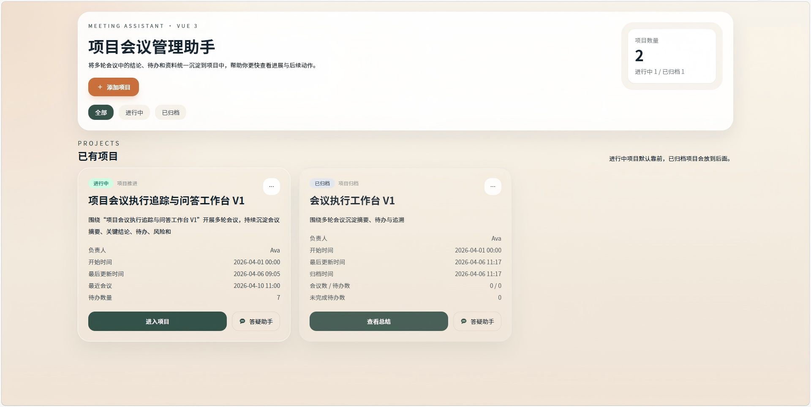
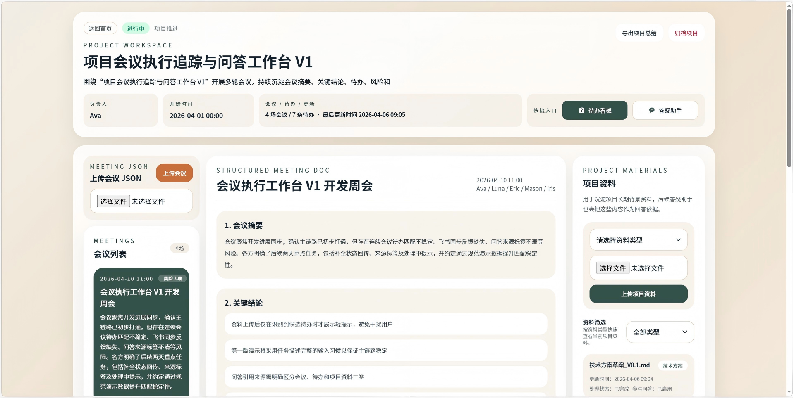
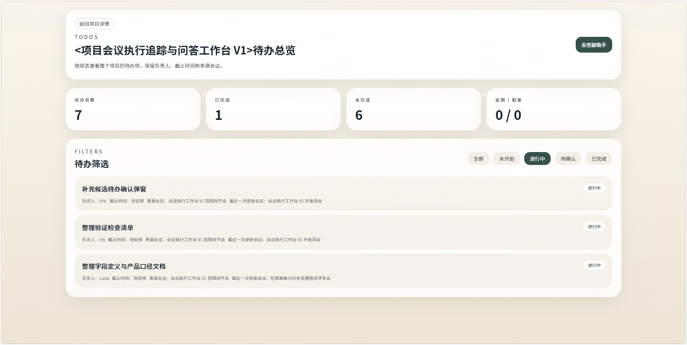
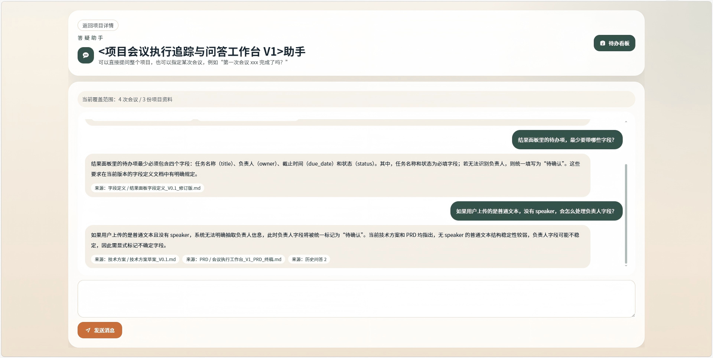

# 项目会议管理助手

将多轮会议中的结论、待办和资料统一沉淀到项目中，帮助你更快查看进展与后续动作。

当前项目包含两条核心链路：
- 会议处理链路：上传原始会议 JSON，输出会议摘要、关键结论、待办、风险，并同步项目待办与资料更新建议
- 项目答疑链路：基于会议、待办、项目资料和检索结果，回答项目级问题

## 页面展示

### 首页


### 项目中台页


### 待办看板


### 答疑助手


## 当前能力

- 项目管理：支持创建项目、查看项目列表、归档/简要归档项目、重新开启项目、删除项目
- 会议处理：支持上传会议 JSON，并生成结构化会议结果
- 待办总览：支持跨会议维护项目待办状态，并区分来源会议与最近一次更新会议
- 项目资料：支持上传资料、资料类型筛选、问答引用、资料更新建议
- 资料联动：上传资料后可识别候选待办，并由用户确认是否更新待办状态
- 项目答疑：支持围绕整个项目进行问答，并保留项目内历史问答记录
- 导出总结：支持生成项目级 Markdown 总结内容

## Agent 架构

系统当前采用“4 个会议处理 Agent + 1 个独立答疑 Agent”的结构：

1. `planner_agent`
负责会议处理策略规划，给后续 Agent 提供本次会议的分析重点。

2. `meeting_analyst_agent`
负责将原始会议记录结构化为摘要、结论、待办、风险等结果。

3. `task_continuity_agent`
负责把本次会议待办与历史待办对齐，判断是新增事项还是历史事项的状态更新。

4. `project_doc_update_agent`
负责判断本次会议是否影响已有项目资料，并生成资料更新结果或建议。

5. `project_qa_agent`
这是独立的项目问答 Agent，不参与会议上传链路；它直接消费检索层返回的会议、待办、资料和问答上下文，输出 `answer + citations`。

## 技术栈

### 后端
- FastAPI、SQLAlchemy、MySQL、LangGraph、ChromaDB、OpenAI Compatible API（当前接入百炼兼容接口）

### 前端
- Vue 3、Vite、Vue Router、Pinia、Tailwind CSS

## 本地运行

```powershell
cd backend
pip install -r requirements.txt
cd frontend-vue
npm install
```

### 启动

```powershell
cd backend
python -m uvicorn app.main:app --host 0.0.0.0 --port 8000

cd frontend-vue
npm run dev
```

## 当前输入约定

### 会议上传

当前会议上传接口接收“原始会议 JSON”，最小推荐格式如下：

```json
{
  "title": "会议执行工作台 V1 范围对齐会",
  "meeting_date": "2026-04-01 10:00",
  "participants": ["Ava", "Luna", "Eric"],
  "utterances": [
    {
      "speaker": "Ava",
      "text": "今天这场会主要想把目标、范围和分工先对齐。"
    },
    {
      "speaker": "Luna",
      "text": "我先补充一下项目背景。PRD v0.1 大家刚刚已经看过。"
    }
  ]
}
```

### 项目资料上传

当前支持的资料类型为：
- `PRD`
- `字段定义`
- `技术方案`
- `测试/验收`
- `参考资料`
- `其他`

